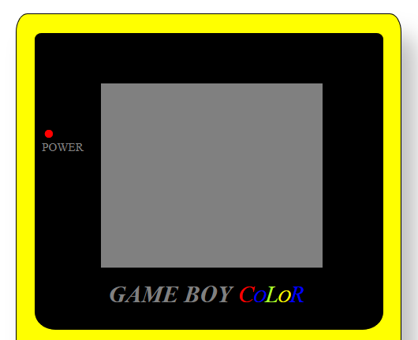
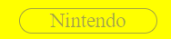
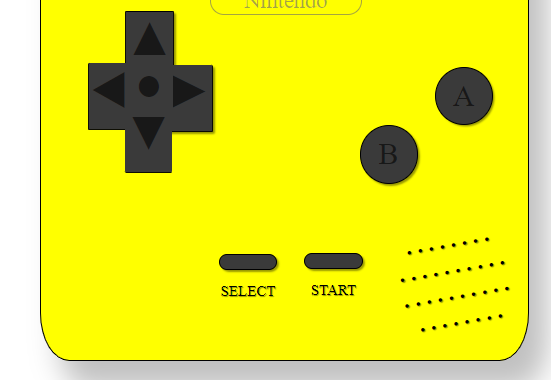

# Proyecto videoconsola

Este es el primer proyecto del bootcamp geeksHubs el cual consta de la realización de una videoconsola maquetandola con HTML & CSS.

-----------

## Tecnologías utilizadas 

Como bien he comentado antes hemos utilizado dos tecnologías:

* HTML
* CSS

-----------

## Proceso de creación 

El proyecto fue dividido en 4 partes:

* Comenzamos realizando la estructura de la consola la cual se compone de un div contenedor en el cual trabajaremos todas las demas partes. 

* Una vez dentro del div contenedor en mi caso llamado "consola" empezaremos a trabajar con la parte "TOP" de la videoconsola, la pantalla de la consola. Los elementos como "Power" y "Gameboy Color" fueron colocados con posiciones relativas.

* Despues empecé a realizar el "mid" el cual se iba a componer solo del logo de "Nintendo". Fue "simple" tan solo tuve que hacer un div, centrarlo, darle un border, al border darle un radius de 20px y conseguido.

* Por ultimo vino la parte más complicada para mi, el "bottom". Fué un verdadero quebradero de cabeza ya que tuve problemas con el pad y a dia de hoy sigue sin gustarme. Tuve que buscar los simbolos en google de flechas y circulos para poder hacerlo. Acto seguido les di un tamaño, un color a los simbolos, otro color de background y a jugar con las posiciones relativas hasta conseguir una posicion la cual me convenciera. Todo lo demas fue relativamente "sencillo" en comparación. Lo que mas me gustó hacer fue el altavoz el cual se compone de literalmente puntos rotados un poco.

---

## Agradecimientos

"Es de bien nacidos ser agradecido", es por eso que quiero agradecer toda la ayuda y paciencia por parte de mis compañeros y del profesorado ofrecida hacia mi persona. Sin ellos esto no habría sido posible.

---
